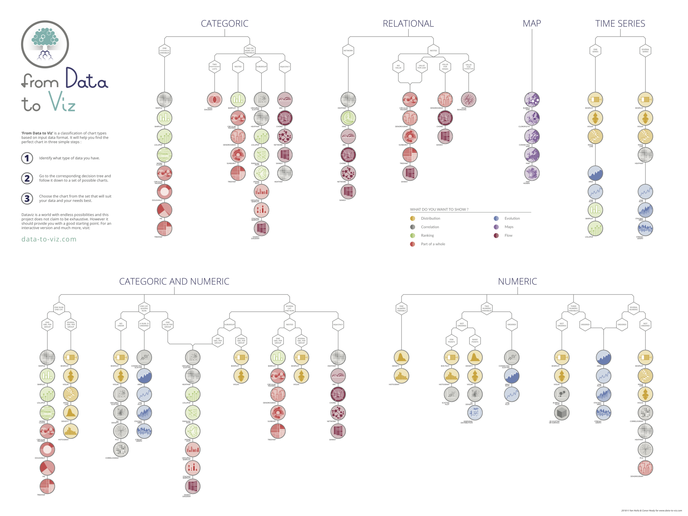

# Charts

Static SVG chart components for the Starlight docs site. All charts are Astro components that render entirely at **build time** — zero JavaScript ships to the browser.

## Tools and stack

| Tool | Role |
|---|---|
| **Astro** (`.astro`) | Component format; frontmatter runs in Node.js at build time |
| **D3** (`d3` npm package) | Data computation (scales, layouts, colour helpers) — runs in frontmatter only |
| **SVG** | Output format — `viewBox`-only sizing, no fixed `width`/`height` |
| **CSS custom properties** | Theme switching (light/dark) without JS |
| **Starlight** | Host site; sets `[data-theme="dark"|"light"]` on `<html>` |

D3 is used for its utility functions in Node.js — `d3.scaleLinear`, `d3.scaleSqrt`, etc. It does **not** manipulate the DOM and no D3 code appears in the browser.

## Directory

```
docs/src/charts/
├── PairMatrix.astro    Symmetric N×N bubble matrix (pair-overlap scores)
├── SpiderChart.astro   Radar / spider chart — N axes, M overlaid series
├── GenreMds.astro      Multidimensional scaling bubble plot with weighted edges
├── Heatmap.astro       Two-way heatmap — numeric value per (row, col) cell
├── GenreGrid.astro     Grid of mini spider petals — many categories × many series
├── GenreVoronoi.astro  Voronoi territory chart — many categories × many series
├── GenreSpider.astro   Single-genre filled spider polygon (for HTML grid layouts)
├── RadialViolin.astro  Radial violin — one continuous violin shape per category ray
├── README.md           This file
└── AGENTS.md           Agent-targeted instructions (machine-readable conventions)
```

## Choosing a chart type

Before building a new component, use the decision tree in `chart-decision-tree.png` (From Data to Viz, Yan Holtz & Conor Healy) to identify the right chart type for your data.



The tree works in three steps:

1. **Identify your data family** — pick the column that matches what you have:
   - **Categoric** — one or more category variables, no numeric axis (bar, lollipop, treemap, …)
   - **Categoric + Numeric** — categories plus a measured quantity (heatmap, violin, boxplot, …)
   - **Numeric** — two or more continuous variables (scatter, bubble, histogram, density, …)
   - **Relational** — nodes and edges (network, chord, sankey, …)
   - **Map** — geographic data (choropleth, bubble map, …)
   - **Time Series** — a numeric variable measured over time (line, area, …)

2. **Follow the branch** for your specific situation (e.g. "one numeric value per group" vs. "several numeric variables").

3. **Choose the chart** that best matches what you want to show — the legend in the image colour-codes intent: Distribution, Correlation, Ranking, Part-of-a-whole, Evolution, Maps, Flow.

### Existing components and their place in the tree

| Component | Data family | Intent |
|---|---|---|
| `PairMatrix.astro` | Relational / Numeric | Correlation matrix (symmetric pair scores) |
| `SpiderChart.astro` | Categoric + Numeric | Part-of-a-whole / multivariate comparison |
| `GenreMds.astro` | Numeric | Correlation (MDS placement) + Relational (edges) |
| `Heatmap.astro` | Categoric + Numeric | Distribution / Correlation across a two-way table |
| `GenreGrid.astro` | Categoric + Numeric | Multivariate tile — one spider petal per category |
| `GenreVoronoi.astro` | Categoric + Numeric | Territory layout — area encodes summed score |
| `GenreSpider.astro` | Categoric + Numeric | Single-series radar polygon (used inside HTML grid) |
| `RadialViolin.astro` | Categoric + Numeric | Distribution along each ray — violin width = score |

## How to add a new chart

1. Create `docs/src/charts/MyChart.astro`.
2. Write all data computation in the frontmatter (Node.js).
3. Render a single `<svg viewBox="0 0 VW VH">` — no fixed `width` or `height` on the element.
4. Add `width: 100%; height: auto` to the wrapping element's CSS.
5. Use the import alias `@charts/MyChart.astro` in MDX files.

## Conventions

### Responsive sizing

Never set `width` or `height` attributes on `<svg>`. Use `viewBox` only and let CSS control the rendered size:

```css
.my-svg {
  display: block;
  width: 100%;
  height: auto;
}
```

This ensures the chart scales to any container width without layout reflows.

### Layout with named constants

Define all spacing as named constants before computing coordinates. This prevents magic numbers and makes gutter adjustments trivial:

```ts
const CELL   = 100;   // grid cell size (must be ≥ 2 × R_MAX + comfortable gap)
const LINE_H = 15;    // px between stacked label lines — declare FIRST (used in TOP)
const GAP    = 16;    // uniform spacing: label edge → nearest bubble edge, both axes
const R_MAX  = 38;    // largest mark radius

const LEFT   = 78 + GAP;                         // fits longest two-line label + gap
const TOP    = LINE_H * 2 + GAP + R_MAX + GAP;   // two header lines + gaps + bubble arc
```

Compute viewBox dimensions last, from the constants:

```ts
const VW = LEFT + N * CELL;
const VH = TOP  + N * CELL + 24;  // small bottom padding
```

### Labels inside the SVG — never in HTML

All axis labels, headers, and annotations must be SVG `<text>` nodes inside the `viewBox`. HTML elements positioned outside the SVG (e.g. via `right: 100%` or flex row) escape the coordinate system and cause page-level overflow.

**Multi-line label vertical centring:**

```ts
const totalH = (label.length - 1) * LINE_H;
const y = cy - totalH / 2 + lineIndex * LINE_H + 4;  // +4 for SVG baseline offset
```

**Column header base Y** (aligns visually with row label horizontal gap):

```ts
const baseY = rowY(0) - R_MAX - GAP - 11;  // -11 empirical visual parity
```

### Light/dark theming

**Always pair both Starlight selectors.** Starlight may set either `[data-theme]` on `<html>` or the `.sl-theme-*` class depending on context:

```css
:global([data-theme="dark"]) .my-element,
:global(.sl-theme-dark) .my-element {
  /* dark mode overrides */
}
```

**Never use `fill` as a presentation attribute on themed elements.** CSS cannot reliably override SVG presentation attributes. Use CSS custom properties instead:

```tsx
/* In the template */
<circle
  style={`--fill-dark:${hex1};--fill-light:${hex2}`}
  class="my-bubble"
/>
```

```css
/* In the style block */
.my-bubble { fill: var(--fill-light); }

:global([data-theme="dark"]) .my-bubble,
:global(.sl-theme-dark) .my-bubble {
  fill: var(--fill-dark);
}
```

**Glow / decorative effects in dark mode only** — use CSS `opacity`, not conditional rendering:

```css
.my-glow { opacity: 0; }

:global([data-theme="dark"]) .my-glow,
:global(.sl-theme-dark) .my-glow {
  opacity: 0.35;
}
```

**Bubble label text**: default `fill: #fff` works for dark mode. Override for light:

```css
.my-label { fill: #fff; }

:global([data-theme="light"]) .my-label,
:global(.sl-theme-light) .my-label {
  fill: oklch(15% 0 0);
}
```

### Import alias in MDX

Always use `@charts/` — never a relative path. Vite resolves MDX from the odyssey source path, and relative paths break:

```mdx
import PairMatrix from '@charts/PairMatrix.astro';
```

The alias is registered in `docs/astro.config.mjs` (Vite `resolve.alias`) and `docs/tsconfig.json` (`compilerOptions.paths`).

### Props: data lives in MDX, not the component

Components must be generic. No default data, no hardcoded domain values. All domain data is passed as JSX props from the MDX file:

```mdx
<PairMatrix
  items={[ { id: 'RL', label: ['Roguelite'] }, ... ]}
  pairs={[ { a: 'RL', b: 'DB', shared: 10 }, ... ]}
/>
```

Type names in the component (`Item`, `Pair`) carry no domain meaning.

## Gotchas

### CSS `%` padding for HTML label alignment does not work

`padding-top: X%` is always relative to the containing block's **width**, not its height. It cannot be used to match a chart's vertical proportions for HTML labels placed outside the SVG.

### `aspect-ratio` + absolutely positioned HTML labels

`right: 100%` on an absolutely positioned element still escapes the container. HTML labels cannot be reliably co-positioned with SVG content without being inside the SVG.

### `overflow: visible` on SVG

Allows marks to paint outside the `viewBox`, but does not prevent page overflow — the browser still allocates layout space based on the rendered dimensions.

### `shared: 8` and `shared: 6` have the same colour in PairMatrix

Both map to `#FF9F43` (orange) in `bubbleStyle()` but different radii (32 vs 28). This is intentional — the radius encodes the value; colour groups into broad tiers.

### SVG `dominant-baseline` vs `+4` vertical offset

`dominant-baseline="middle"` centres text on the computed baseline, not the visual cap-height centre. A `+4` empirical offset on multi-line row labels corrects for this and should be preserved.
