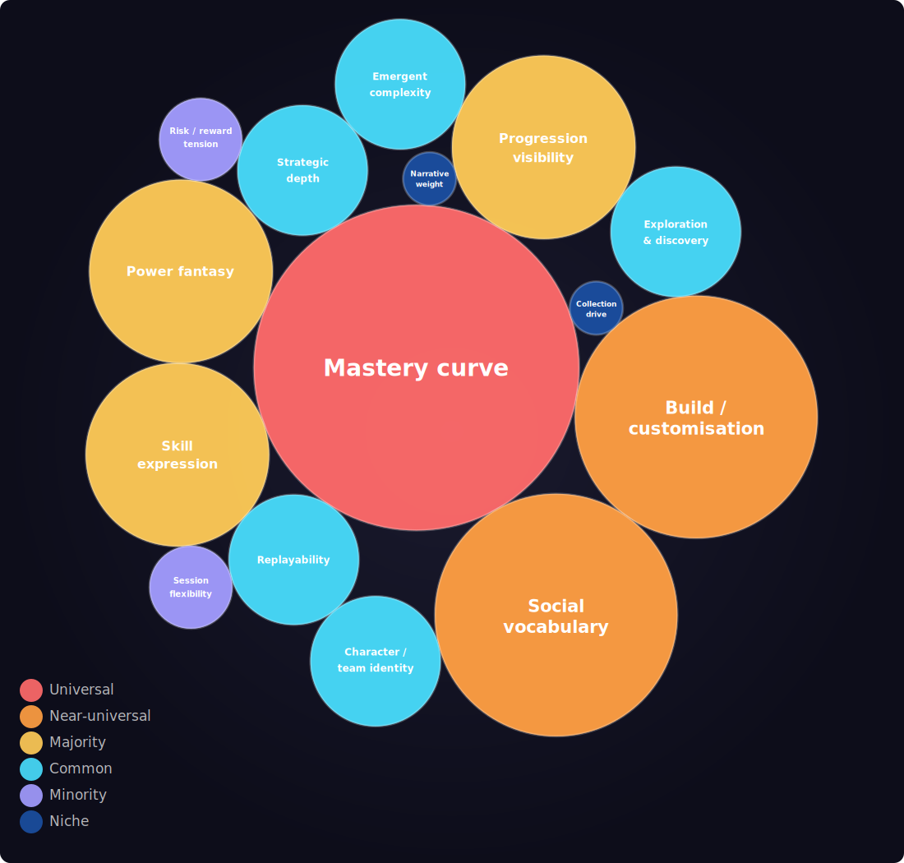
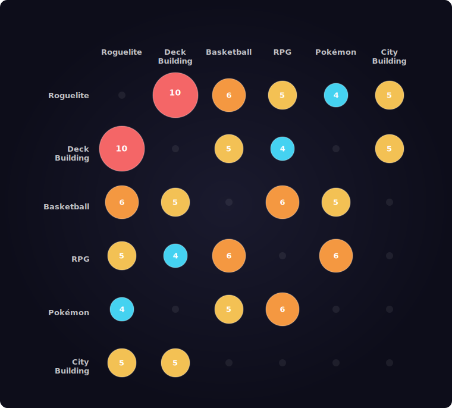
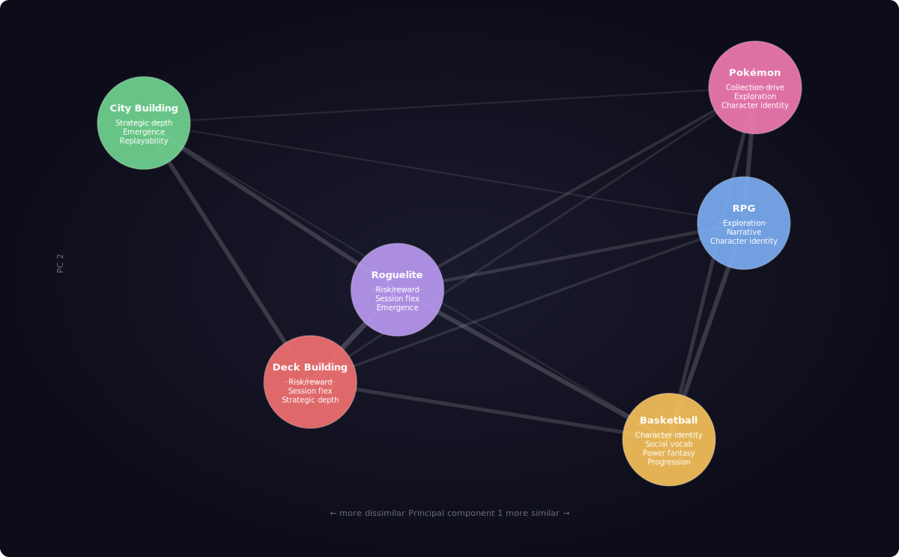

### What the analysis shows

The six genres share a clear hierarchy of design priorities. Three qualities — mastery curve, build/customisation, and social vocabulary — are near-universal: present in five or six of the six genres and therefore the safest foundation for any game targeting players drawn from across this set.

Expand

A second tier (skill expression, power fantasy, progression visibility) is broadly cross-genre. Below that, qualities become genre-specific and do not carry across audiences.

The pair-overlap and MDS data both point to the same structural finding: Basketball, RPG, Roguelite, and Deck Building form a tightly connected cluster. They share more design priorities with each other than with any genre outside the group. City Building is the outlier — its priorities (emergent complexity, spatial strategy, systems-over-identity) diverge from the rest of the cluster and are not strong candidates for import into a basketball-adjacent game. Pokémon is structurally an RPG variant with a collection and discovery layer added on top; its most relevant contribution to this design space is the team-as-build model, not the world-exploration mechanics.

The most commercially durable games across all five relevant genres reward the same underlying player behaviour: constructing something personal (a character, a deck, a build, a team) and then testing it. That is the genre-crossing hook. Games that deliver this feeling — and make the player feel the construction was their own — sustain long-tail engagement and generate community vocabulary around the build system rather than around the content.

### Implications for genre archetype selection

The analysis supports drawing primarily from **Basketball, RPG, and Roguelite** as the core archetype mix. These three genres share six, six, and six qualities respectively with each other in pairwise comparison — the strongest connections in the dataset.

Expand

Deck Building adds relevant structural ideas (engine building, synergy discovery, controlled randomness) but functions more as a design-pattern library than a genre to emulate wholesale, given that its distinguishing mechanical surface (cards as the medium) is the vehicle rather than the experience.

City Building should be treated as a source of specific mechanics to consider (milestone unlocks, exploration-as-reward pacing) rather than a genre to inherit identity from. Its design DNA — systems-over-identity, spatial problem-solving — does not reinforce the qualities that make the other genres work for a basketball-centred game.

Pokémon's team composition model is the one element worth examining closely: it shows that build identity can be distributed across a roster of distinct units rather than concentrated in a single protagonist, and that this distributed model can sustain both casual and competitive audiences simultaneously without either group compromising the other's experience.

### Single-protagonist vs. Roster focus

The open question from the [Deck Building Games section in the Inspiration document](/docs/1-inspiration) — whether cards (or equivalent units) represent skills augmenting a single player, or players recruited into a team — is addressed directly by the genre data.

Expand

**The single-protagonist model is supported by more of the reference genres.** RPG, Basketball (MyPlayer mode), and Roguelite all centre player identity on one character whose build is the primary creative surface. The emotional hook in each case is personal: the character is a projection of the player's choices. Social vocabulary and mastery curve — the two qualities that appear in nearly every genre — are both fully served by a single-protagonist model: one player discussing their build with another is the genre-crossing social behaviour the data consistently shows.

**The roster/team model is a genuine alternative, but changes the design substantially.** Pokémon shows that roster building can sustain deep build identity and a competitive community, but the emotional mechanism is different: the team is the build, and identity is distributed. This model carries collection drive (currently a single-genre quality, unique to Pokémon*) and character/team identity, but loses the concentrated personal investment of the single-protagonist arc. NBA 2K's franchise mode and MyTeam mode confirm that roster-focused play exists in the basketball space — but player reception data shows that the single-player MyCareer arc drives significantly stronger retention and narrative investment than team management modes.

**The data favours starting with the single-protagonist model.** It has a broader base of genre support, a more direct connection to the RPG and Roguelite mechanics that are the clearest design analogues, and a well-established community behaviour (build discussion, archetype comparison) that scales without requiring multiplayer infrastructure. The roster model could be introduced as a secondary layer — analogous to how Pokémon's trading and competitive metagame extend a fundamentally single-player structure — without being the primary design target.

---

*\* Deck building games assemble a deck from scratch each run — the cards do not persist between runs and are not owned. The collection drive quality as scored here requires a persistent, growing personal library across sessions, which is Pokémon's mechanic but not the core deck building loop. Some deck builders add a weak cross-run unlock layer, but accumulating a permanent roster is not what drives the genre's retention.*

## Qualities

  
Data

Fifteen design qualities were scored across six genres. Mastery curve is the only universal quality, present in all six. Build/customisation and social vocabulary appear in five. The bottom four qualities — risk/reward tension, session flexibility, collection drive, and narrative weight — are effectively genre-exclusive, concentrated in one or two genres each.

| Quality | Presence | Genres |
|---|:---:|---|
| Mastery curve             | `██████` | Basketball, RPG, City Building, Pokémon, Roguelite, Deck Building (6) |
| Build / customisation     | `█████·` | Basketball, RPG, Pokémon, Roguelite, Deck Building (5) |
| Social vocabulary         | `█████·` | Basketball, RPG, Pokémon, Roguelite, Deck Building (5) |
| Skill expression          | `████··` | Basketball, City Building, Roguelite, Deck Building (4) |
| Power fantasy             | `████··` | Basketball, RPG, Roguelite, Deck Building (4) |
| Progression visibility    | `████··` | Basketball, RPG, Pokémon, Roguelite (4) |
| Replayability             | `███···` | City Building, Roguelite, Deck Building (3) |
| Strategic depth           | `███···` | City Building, Roguelite, Deck Building (3) |
| Emergent complexity       | `███···` | City Building, Roguelite, Deck Building (3) |
| Exploration & discovery   | `███···` | RPG, City Building, Pokémon (3) |
| Character / team identity | `███···` | Basketball, RPG, Pokémon (3) |
| Risk / reward tension     | `██····` | Roguelite, Deck Building (2) |
| Session flexibility       | `██····` | Roguelite, Deck Building (2) |
| Collection drive          | `█·····` | Pokémon (1) |
| Narrative weight          | `█·····` | RPG (1) |

Quality Universality

Three qualities — mastery curve, build/customisation, and social vocabulary — appear across five or six of the six genres surveyed, making them the closest thing to universal design pillars in this space. A second cluster (skill expression, power fantasy, progression visibility) appears in four genres, still broadly cross-genre but not universal. Everything below that is genre-specific: risk/reward tension and session flexibility belong almost exclusively to roguelites and deck builders; collection drive and narrative weight are effectively single-genre properties. The implication for @hoop/odyssey: any design that foregrounds mastery curve, build identity, and social vocabulary is already aligned with the majority of the reference genres simultaneously.

Shared Qualities by Pair

The pair counts reveal two distinct clusters of genre affinity. Roguelite and Deck Building share ten qualities — the highest overlap in the set — confirming they are effectively the same design space expressed through different mechanics. Basketball connects strongly to both RPG and Roguelite (six shared qualities each), meaning it sits at the intersection of character-building and run-based progression. City Building is the most isolated genre: its strongest links are to Roguelite and Deck Building (five each), driven entirely by strategic depth, emergent complexity, replayability, and skill expression — not the social or progression qualities that define basketball's connections. Pokémon clusters with RPG (six shared), confirming that creature-collection is structurally an RPG variant. The practical implication: a design that combines basketball's mastery and social vocabulary with roguelite's build crafting and risk/reward tension is reinforced by the largest overlap in the dataset.

**Basketball ↔ RPG (6):** Build / customisation · Progression visibility · Character / team identity · Mastery curve · Social vocabulary · Power fantasy

**Basketball ↔ Pokémon (5):** Build / customisation · Progression visibility · Character / team identity · Mastery curve · Social vocabulary

**Basketball ↔ Roguelite (6):** Build / customisation · Progression visibility · Skill expression · Mastery curve · Social vocabulary · Power fantasy

**Basketball ↔ Deck Building (5):** Build / customisation · Skill expression · Mastery curve · Social vocabulary · Power fantasy

**RPG ↔ Pokémon (6):** Build / customisation · Progression visibility · Exploration & discovery · Character / team identity · Mastery curve · Social vocabulary

**RPG ↔ Roguelite (5):** Build / customisation · Progression visibility · Mastery curve · Social vocabulary · Power fantasy

**RPG ↔ Deck Building (4):** Build / customisation · Mastery curve · Social vocabulary · Power fantasy

**Pokémon ↔ Roguelite (4):** Build / customisation · Progression visibility · Mastery curve · Social vocabulary

**City Building ↔ Roguelite (5):** Strategic depth · Emergent complexity · Replayability · Skill expression · Mastery curve

**City Building ↔ Deck Building (5):** Strategic depth · Emergent complexity · Replayability · Skill expression · Mastery curve

**Roguelite ↔ Deck Building (10):** Build / customisation · Strategic depth · Emergent complexity · Replayability · Risk / reward tension · Skill expression · Mastery curve · Session flexibility · Social vocabulary · Power fantasy

Multidimensional Scaling

The scaling separates the six genres into two distinct groupings. Roguelite and Deck Building are close neighbours, confirming their near-identical design DNA. Basketball sits closest to RPG and moderately close to Pokémon — its design affinities run through character identity and progression, not strategic systems. City Building is the clear outlier, positioned far from every other genre: its design priorities (emergent complexity, infrastructure, spatial strategy) have almost no overlap with the social, narrative, and build qualities that define the other five. The distance between City Building and the rest of the cluster is the most informative single data point: it shows that strategic depth and emergent complexity are not genre-crossover qualities — they are specific to genres that prize systems over identity.

## Roguelite Games

Combining skills and perks in creative ways to build a player, with the drive to discover new synergies and strategies each run.

### Core Mechanics

Roguelites relax the strict rules of classic roguelikes while retaining permadeath and procedural generation. The key shift is the addition of **persistent meta-progression**: each run ends on death, but unlocks — new characters, items, starting bonuses — carry over permanently. This gives every failed run a sense of forward momentum.

Expand

**Defining mechanics across the genre:**

1. **Procedural generation** — levels, items, and encounters are randomised each run, ensuring no two playthroughs are identical. Its deeper purpose: ensuring no two builds face the same test, so the game cannot be solved by memorisation alone.
2. **Permadeath (softened)** — the run ends on death, but meta-progression persists. Failure feels meaningful rather than punishing.
3. **Meta-progression** — persistent unlocks across runs (characters, abilities, items, starting bonuses) reward repeated play.
4. **Run-based structure** — sessions are short and completable, with clear goals and a defined end state (vs. the endless nature of classic roguelikes).
5. **Build crafting and synergy discovery** — per-run item and skill combinations; the excitement of discovering unexpected synergies is a core player motivation. Critically, player-discovered synergies (combinations the designer did not anticipate) are among the genre's greatest moments.
6. **Choice architecture** — meaningful branching decisions throughout each run: item rewards, route selection, risk/reward tradeoffs.
7. **Emergent complexity** — simple systems interact to produce surprising, powerful outcomes; mastery comes from understanding these interactions.
8. **Escalating difficulty** — optional harder modes (e.g. the Heat system in Hades, Ascension in Slay the Spire) extend challenge for veteran players.
9. **Narrative integration** *(Hades model)* — story and world are revealed progressively across runs; lore is not lost on death, so failed runs still advance the narrative.
10. **Pre-run customisation** — allowing the player to choose a starting weapon, character, boon, or keepsake before each run negates pure repetition without sacrificing randomness. The best implementations let these choices prioritise a specific build direction from the outset (e.g. Hades weapon + aspect + mirror, Warm Snow starting boon).
11. **World structure and milestones** — clear map layouts, distinct zones, and visible progression markers give the player a "flag to plant" — a sense of farthest reach to strive towards. Procedural generation should work within this structure, not replace it.
12. **Power fantasy** — deliberately giving the player moments where they feel they have broken the game. This makes daunting, mortality-heavy games feel conquerable and keeps the player motivated. The power spike is always temporary, creating a rhythm of empowerment and humility that drives the next run.

**Notable examples:** *Hades*, *Slay the Spire*, *The Binding of Isaac*, *FTL: Faster Than Light*, *Rogue Legacy*, *Spelunky*, *Vampire Survivors*, *Crypt of the NecroDancer*, *Downwell*, *Enter the Gungeon*, *Dead Cells*, *Balatro*.

**Sources:** Wikipedia — Roguelike (Berlin Interpretation and roguelite distinctions); Game Developer (gamedeveloper.com) — Hades narrative design analysis; YouTube — "What Makes a Good Roguelike" (rcX9BDgvkws); "Why Roguelikes Work" (0cvu_ZyBv8g); "Roguelike Progression Systems" (yOfgUFx9RkU); "How to Design a Roguelike" (y5DSSU_KsrQ); "How to Fail at Making a Roguelike" (TAcsYWGtUto).

### What Makes a Roguelite Successful

Research from rogueliker.com — an independent specialist publication covering the genre since at least 2020 — identifies recurring qualities in the genre's most successful games:

**1. The "just one more run" loop**
The short, self-contained run structure is the engine of player retention. Because each attempt is finite, players are always willing to start again. The best games ensure that losing still feels like progress — either through meta-unlocks, knowledge gained, or story revealed.

Expand

**2. Build variety that rewards experimentation**
Rogueliker consistently highlights *item combination depth* as a hallmark of the best games (Binding of Isaac, Slay the Spire, Hades). Players must be able to find genuinely different, equally valid builds across many runs. The discovery of a powerful new synergy is described as one of the genre's primary emotional payoffs.

**3. Risk vs. reward as the central per-run tension**
Branching path decisions — which route to take, which reward to pick, when to spend resources — must carry real weight. *FTL: Faster Than Light* is cited for doing this exceptionally well: every decision is a risk/reward calculation with lasting consequences for the run. Risk vs. reward may be the single most important per-run mechanic: cursed items (huge power boost, dangerous downside), elite fights for better rewards at the cost of health, preserving ammunition for a harder boss — these choices define the genre's tension. Crucially, when the player picks a cursed item and dies, they blame themselves, not the game. The player's own agency is what makes failure feel fair.

**4. Accessible entry, mastery ceiling**
The most commercially successful titles in the genre (Slay the Spire, Hades, Balatro) balance approachability with depth. Slay the Spire 2's developer Anthony Giovannetti explicitly stated their goal as: *"add more complexity for returning players without overwhelming newcomers."* Games that fail to onboard new players struggle to find an audience beyond the hardcore fanbase.

**5. Polished, responsive feel**
Rogueliker's reviews repeatedly cite *moment-to-moment gameplay quality* as a deciding factor. Enter the Gungeon is praised for the physical feel of its environments; Hades for its combat fluidity. A technically rough game struggles even if the systems are deep. The reviewer's phrase: *"it needs to feel great to roll around in."*

**6. Strong aesthetic identity**
Every breakout hit has a distinctive and cohesive visual/audio identity: Hades (Greek mythology + Supergiant's painterly art), Slay the Spire (hand-drawn fantasy card art), Binding of Isaac (grotesque pixel horror), Balatro (retro neon poker). The identity makes the game instantly recognisable and builds community around it.

**7. Meta-progression that doesn't invalidate skill**
The snowball effect of meta-progression (getting stronger across runs) must be balanced so skill still matters. Rogueliker notes that top games scale challenge to match player strength, keeping the game demanding even as unlocks accumulate. Pure grind-to-win undermines the genre's core appeal.

**8. Community and longevity through content depth**
The most-played games in the genre (Slay the Spire is still on Steam friend lists years after launch, per rogueliker.com) have enough content variety that players continue discovering new things after dozens of hours. This drives word-of-mouth and long tail sales.

**9. Early Access as a legitimate launch strategy**
Rogueliker's coverage notes that both Slay the Spire and Hades launched in Early Access and used player feedback to refine balance at speed. The Slay the Spire 2 developer confirmed: *"that direct feedback allows us to improve the game at an incredible speed."* Early Access is now an established genre convention, not a risk flag.

**10. Engine building as the conceptual core**
The genre's appeal is best understood through the concept of *engine building* (a term from board game and CCG design): the player makes strategic decisions to construct a character/build, then pilots that engine through a series of tests. The ideal payoff is watching the engine perform in the environment it was built for. This is what separates roguelikes from games that merely have procedural levels — procedural generation ensures the engine faces an unpredictable test, making memorisation irrelevant. Without meaningful engine building, procedural levels alone do not make a roguelike.

**11. Compression of RPG progression**
Roguelikes compress what would be a 100–200 hour RPG character arc into a single 10–90 minute run. This structure forces players to experiment with builds and character types they would never commit to in a long-form RPG (where the investment cost is too high). The run structure is what gives the genre its exceptional replayability: players can be a wizard, then a rogue, then a fighter — each in under an hour.

**12. Simplicity-first design**
The most effective roguelikes build on a simple, familiar gameplay base and layer complexity on top. An accessible core means players can quickly understand the mechanics and focus on mastering them. The ideal is that the player's *skill* visibly improves, not just their stats — the game should feel like *you* are getting better, not just your character getting stronger (see: Downwell). Accessible complexity also prevents alienating new players from discovering the depth beneath.

**13. Within-run progression quality: every choice should be valid**
The quality of per-run decision-making depends on ensuring that every choice presented is a genuinely viable option. When all choices are valid, players are forced into deeper, more interesting decisions. Systems that interconnect — where the same element (e.g. a health pickup, a carried item, a sacrifice) is relevant across multiple mechanics simultaneously — produce richer decision trees than isolated upgrades. Simple, identical stat bumps (+5% speed, +5% damage) that don't interact with the core mechanic are the clearest failure mode; unique items with synergies tied to the core loop are the gold standard.

**14. Streamability and content-creator reach**
The run-based structure and procedural randomness make roguelikes particularly well-suited to streaming: every run is different, so viewers are always watching something new. This has been a meaningful driver of the genre's growth and commercial reach beyond traditional word-of-mouth.

**15. Hard to balance, not hard to design**
The roguelike genre is relatively straightforward to design at a structural level (find a core mechanic, add roguelike elements, generate large quantities of items/passives). The real difficulty — and the defining challenge of quality in the genre — is *balance*: ensuring the randomness is fair, that no combination trivialises the game, that the difficulty curve remains meaningful, and that every item or skill is situationally relevant.

**Commercially successful launch peaks on Steam (SteamDB data via rogueliker.com):**

| Game | Launch-day peak concurrent players |
|---|---|
| Elden Ring: Nightreign | 313,593 |
| Hades 2 | 103,567 |
| Risk of Rain 2 | 70,194 |
| The Binding of Isaac: Rebirth | 69,747 |
| Mewgenics | 65,962 |
| Deep Rock Galactic: Survivor | 56,943 |
| Loop Hero | 51,156 |

**Sources:** rogueliker.com — "The Best Roguelike Games" (Feb 2026); "What is a roguelike?" (Aug 2024); "Preparing for Slay the Spire 2" (Feb 2026); "The biggest roguelike and roguelite launches on Steam" (Feb 2026).

### Player Reception and Market Signal

Steam review data and developer interviews confirm which genre qualities players themselves identify as decisive:

**1. Narrative integration as a retention driver, not a feature**
Hades (Supergiant Games, 2020) has 298,717 total Steam reviews at 98% positive (English) and a Metacritic score of 93. The community tags most applied by players — in order: Action Roguelike, Roguelite, Hack and Slash, **Story Rich**, **Great Soundtrack**, **Replay Value**, Perma Death — reveal that narrative and audio identity are foregrounded by the playerbase, not only mechanical depth. The co-occurrence of "Story Rich" and "Replay Value" as top tags is significant: it confirms that narrative integration is not in tension with replayability, but actively amplifies it. Players return across runs specifically *because* the story advances.

Expand

**2. The "Hades-like" as an accidental template**
In a February 2026 interview at the DICE Awards (Game Developer, Bryant Francis), Supergiant Games' Greg Kasavin and Amir Rao confirmed the "Hades-like" subgenre label was entirely community-created post-launch and came as a surprise. Kasavin: *"We thought we were simply making a roguelike. We just made the decisions that felt right and natural to us."* The replicable structure that other developers extracted: a home-base hub players return to between runs; the loop of "clear encounter → meet character → receive reward → repeat"; and narrative that accumulates across deaths. These were design decisions, not a design framework — which means the pattern is extractable for new genres.

**3. Accessibility and forgiveness as crossover mechanics**
Kasavin explicitly described Hades as *"a little bit more forgiving"* than contemporaries — a deliberate accessibility choice. Hades' Permanent upgrades (Mirror of Night) mean players do not need to be skilled to access the story, while the Pact of Punishment system extends challenge for veterans. This dual structure — accessible floor, steep ceiling — is what enables the game to sustain both "Difficult" and "Story Rich" as co-existing community tags, and is a primary factor in its crossover appeal beyond the roguelite fanbase.

**Sources:** Steam product page — Hades (app/1145360, accessed Feb 2026); Game Developer — "Hades devs: accidentally inventing a subgenre was 'surreal'" (Bryant Francis, Feb 26 2026).

## Deck Building Games

Collection and synergy mechanics — cards can represent either skills/items augmenting a single player's progression, or recruited players forming a team roster. This opens two distinct design directions for the game.

### Core Mechanics

The deck building genre originates in tabletop games (Dominion, Magic: The Gathering), was first brought to video games by DreamQuest (2014), and crystallised into its modern roguelite form by Slay the Spire (2017). Its defining structure: start a run with a minimal deck, acquire new cards through combat rewards, events, and shops across the run, and pilot the resulting build through escalating encounters until victory or death.

Expand

**Defining mechanics across the genre:**

1. **Deck as the engine** — the deck is not a loadout but a machine being assembled in real time. Cards interact to produce effects beyond their individual values; the whole is always greater than the sum of its parts.
2. **Card identity** — each card must have its own distinct mechanical and thematic character: unique upsides, unique downsides, and a clear role. Generic cards (a plain stat boost with no interaction hooks) are a design failure; they produce no decisions and create no memorable moments.
3. **Three tiers of synergy** — the healthiest card pools layer three kinds of synergy: *hard synergies* (explicit keyword-to-keyword bonuses that give players a clear build anchor), *soft synergies* (implied relationships between cards that reward players who discover connections themselves), and *flex synergies* (draw, filtering, and manipulation cards that amplify an existing strategy without contributing directly). Overloading a pool with hard synergies reduces deck building to a formality; the best designs lean heavily on soft synergies.
4. **Deck size as a strategic variable** — larger decks are more versatile but less consistent; thinner decks cycle faster but are fragile. Card deletion (removing cards from the deck permanently) is one of the genre's most important and most underestimated mechanics. Mastering it is a key step in player development.
5. **Card rarity as progression structure** — common cards are simple and broadly synergetic; rares are powerful but narrow. This ensures early-game viability for all cards while preserving late-game payoff. Games without rarity tiers risk excessive run-to-run variance and inconsistent build opportunities.
6. **Controlled randomness** — card rewards, events, and shop stock are random, but the player always chooses from a curated selection rather than receiving a single fixed outcome. This preserves agency while maintaining replayability. The best designs allow players to *manipulate* apparent randomness (e.g. reducing an enemy's HP to improve the distribution of a multi-hit random-target card).
7. **Out-of-combat decision layer** — shops, rest sites, events, and path selection link combat encounters and maintain strategic tension between fights. Events in particular function as risk/reward nodes: choosing to engage (and what to accept) with visible or hidden consequences. This layer is the connective tissue between individual encounters.
8. **Unique mechanic requirement** — because deck building is text-based and turn-based, two games with the same core loop feel near-identical regardless of their story, setting, or art. Every new game needs at least one structural differentiator: a positioning layer (Cobalt Core), multi-board management (Monster Train), a non-card medium (Balatro's jokers, Peglin's orbs, Astria's dice), or a party system (Across the Obelisk, Roguebook). Without it, the game is a Slay the Spire clone.
9. **Scaling and the power fantasy** — the deck should have the capacity to become genuinely, extravagantly powerful by late run. This is the genre's central emotional payoff: a self-reinforcing engine so efficient that enemies cannot keep pace. Scaling mechanics (cards that grow stronger each time they are played within a single encounter) are the primary vehicle for this. The feeling of having "broken" the game is a reward, not a design failure.
10. **Transparency of enemy intent** — showing the player what each enemy will do on their next turn is now standard. It shifts the game's challenge from reaction to planning, and rewards forward thinking rather than reflexes. Removing this information (as in the optional toggle in Monster Train) tends to slow the game down without adding meaningful tension for most players.
11. **Clarity over complexity** — complexity that is not legible is not depth, it is friction. Replacing card text with symbols, proliferating damage types with separate resistances, or requiring players to track too many simultaneous systems simultaneously creates paralysis rather than interesting decisions. Slay the Spire's design standard — every card reads plainly as text, tooltips are fast, symbols never appear on cards — is the practical benchmark.
12. **Pacing and moment-to-moment feel** — the genre is slower than action games by nature, making pacing a design priority. Runs that drag (too many turns per encounter, too much per-card admin, slow animations) cause players to abandon them mid-run. A run should feel fast even if it is long.

**Notable examples:** *Slay the Spire*, *Monster Train*, *Balatro*, *Cobalt Core*, *Inscryption*, *Roguebook*, *Dicey Dungeons*, *Wildfrost*, *One Step from Eden*, *Across the Obelisk*, *DreamQuest*.

**Sources:** YouTube — "What Makes a Great Deckbuilder?" (d_gBRNAgBKQ); "What Makes A Good DECK BUILDING Roguelike?" (UG_T3S6-qUw); "Can Any Roguelike Deckbuilder Beat Slay the Spire?" (LLeuofCTq5M).

### What Makes a Deck Building Game Successful

**1. The creativity and synergy discovery payoff**
The genre's primary emotional hook is the satisfaction of making something unexpected work — assembling a combination of cards that the designer did not predict, and watching it perform. This is distinct from the roguelite concept of meta-progression; it happens *within a single run* and requires no persistent reward. The feeling of having been smart is its own payoff. Games that do not produce this feeling — because their card pools are too narrow, their synergies too obvious, or their builds too prescribed — fail to deliver the genre's core promise.

Expand

**2. Card identity as the foundation of everything**
Cards without distinct identities produce flat, interchangeable decisions. When every damage option is mechanically equivalent, there is no reason to prefer one over another; deck building collapses into stat optimisation. The strongest card pools give every card a mechanical quirk that creates both a use case and a constraint — something it does unusually well, and a condition it imposes. This is what makes deck building feel like *composing* rather than *collecting*.

**3. Simplicity as the entry point**
The most commercially successful deck builders (Slay the Spire, Balatro) are defined by a core mechanic simple enough that a new player grasps it within minutes, layered with enough systemic depth that hundreds of hours of mastery remain. Balatro's success is directly attributed to its accessibility: players unfamiliar with poker rules can still understand and enjoy it immediately. Complexity that is front-loaded or gatekept behind jargon actively reduces the potential player base.

**4. The unique mechanic as the identity of the game**
Because the genre's text-based turn structure is inherently limited in producing novel sensory experiences, visual and audio differentiation alone are insufficient to make a deck builder feel original. The structural differentiator — the game's "gimmick" — does the identity work that physics and animation do in action games. It also enables unique card design: cards built around a novel system cannot be copies of cards from other games.

**5. Out-of-combat design as the connective tissue**
The section of the game between fights is not dead time — it is where strategic stakes are set. Route selection, resource allocation (money, health, card deletion), and event decisions determine the conditions under which the next fight is fought. Games that treat the out-of-combat layer as purely functional (a menu between arenas) miss the opportunity to generate meaningful decisions that transcend individual encounters.

**6. The "cards don't have to be cards" insight**
The mechanical identity of the genre — collect items through a run, compose them into a system, pilot that system through encounters — does not require physical cards. Dice (Astria Ascending), orbs (Peglin), jokers (Balatro), and backpack items (Backpack Hero) all deliver the same design experience while creating fresh aesthetic and thematic territories. This freedom is increasingly exploited by successful new entries.

**7. Balancing depth against complexity**
More mechanics do not produce more depth. Across the Obelisk's nine damage types, each with unique resistance values and corresponding debuffs, is cited as an example of added complexity that *flattens* strategic variety rather than expanding it — because the correct response to any damage type becomes formulaic. Depth comes from systems that interact in non-obvious ways across a small number of dimensions. The test is whether a given mechanic *changes how you play*, not just how much you have to track.

**8. Presentation as retention**
In a genre where players will spend multiple minutes on a single combat screen, visual and audio quality have outsized influence on willingness to continue. Cobalt Core's vaporwave space aesthetic, Monster Train's demonic factory setting, and Balatro's retro neon are all cited as examples where presentation created community identity and sustained player engagement beyond mechanical novelty alone.

### Player Reception and Market Signal

**1. Genre benchmarks confirmed by scale**
The two titles that define commercial success in the genre have near-identical review profiles at extraordinary scale. Slay the Spire (Mega Crit, 2019): 205,898 total Steam reviews, **97% positive**, Metacritic 89. Balatro (LocalThunk/Playstack, 2024): 184,807 total reviews, **98% positive**, Metacritic 90. Both maintain strong recent review scores years after launch (Slay the Spire: 96% across 2,819 recent reviews; Balatro: 96% across 2,757 recent reviews as of Feb 2026). This long-tail retention — not launch-peak reviews — is the defining commercial signal: the genre's run-based structure sustains player engagement at a rate that most other genres do not match.

Expand

**2. Community tags as player-stated value signals**
The most-applied community tags for both benchmarks tell the same story. Slay the Spire's top tags: Roguelike Deckbuilder, Card Game, Card Battler, Roguelike, Deckbuilding, Turn-Based, Strategy, Singleplayer, **Replay Value**, Indie, Difficult. Balatro's top tags: Card Game, Roguelike, Roguelike Deckbuilder, Deckbuilding, Singleplayer, Strategy, **Replay Value**, Roguelite, Turn-Based, **Choices Matter**, **Relaxing**, **Difficult**. Balatro's simultaneous tagging as both "Relaxing" and "Difficult" reflects the genre's unique capacity to sustain a flow state — challenge perceived as engaging rather than punishing. "Choices Matter" appearing as a top player-applied tag confirms that the out-of-combat decision layer is experienced as meaningful by players, not just designers.

**3. Crossover appeal as the growth mechanism**
Both benchmarks succeeded by converting players who did not identify as card game or roguelike fans. Rock Paper Shotgun's review headline: *"Slay The Spire made me fall in love with deck-building."* Waypoint/Vice: *"Slay the Spire is the Roguelike Card Game I Never Knew I Wanted."* Balatro's marketing description — *"hypnotically satisfying"* and *"the ultimate roguelike flow state"* — explicitly targets the sensory experience, not the mechanical genre category. PC Gamer (91): *"the reason Valve should rename their handheld 'the Balatro machine.'"* ScreenRant (5 stars): *"addictively delicious, menacing creation which devours hours without mercy."* The language of addiction and compulsion is consistent across coverage of both games — the "just one more run" loop is the crossover hook, not genre familiarity.

**4. Accessibility and familiar anchors as market entry points**
Balatro entered the market via poker — a mechanic familiar to a vastly larger audience than roguelite card games. Players do not need to know poker rules to play, but the vocabulary (hand rankings, suits, flushes) lowers cognitive entry cost. Slay the Spire made the deck builder accessible to players who had never played Dominion or MtG by reducing the card pool vocabulary and making all card text immediately legible. The lesson: a familiar conceptual anchor (poker, standard card mechanics) reduces acquisition resistance even when the game underneath is genuinely new.

**5. Valve's market curation as a genre-legitimacy signal**
Valve offers an official bundle pairing Slay the Spire and Balatro on Steam — treating them as the canonical genre pair. This curation has commercial consequences: players who finish one are actively directed to the other, and the bundle's existence signals to new buyers that these are the authoritative genre entries. For any new deck builder, displacing or differentiating from this canonical pair is the primary go-to-market challenge.

**Sources:** Steam product pages — Slay the Spire (app/646570) and Balatro (app/2379780), accessed Feb 2026; Steam bundle — Balatro + Slay the Spire (bundle/46486); Game Developer — Hades devs interview (Feb 2026).

## Basketball Video Games

Core sport simulation and single-player career progression (NBA 2K's MyPlayer) define the primary gameplay loop, including player customization and stat-driven development.

### Core Mechanics

Basketball video games span two distinct sub-genres — simulation and arcade — but the commercially dominant form is the simulation, led by NBA 2K. The defining structural feature is the **dual-mode architecture**: a full team-vs-team simulation layer coexists with a character-centred career mode in which the player controls a single athlete from amateur to professional peak.

Expand

**Defining mechanics across the genre:**

1. **Authentic sport simulation** — court positioning, offensive and defensive schemes, play-calling, stamina, and momentum systems that model real basketball dynamics. Depth here is the genre's primary quality signal; simulation fans will forgive visual shortcomings but not shallow on-court mechanics.
2. **MyPlayer / career mode** — a protagonist-centred single-player arc: create a player, develop attributes through games and training, navigate relationships with teammates and coaches, and ascend to elite status. The RPG-adjacent structure (attribute trees, skill progression, narrative choices) is what drives the genre's overlap with @hoop/odyssey's design territory.
3. **Attribute and skill development** — players level up via earned experience or currency, allocating points to physical (speed, strength, vertical) and skill (ball handling, shooting, passing, defence) attributes. The combination creates a personal build identity — a "badge system" (NBA 2K) allows further specialisation into archetypes (sharpshooter, playmaker, interior scorer).
4. **Badge and perk systems** — meta-layer upgrades that activate conditional bonuses (e.g. enhanced shooting accuracy from mid-range, reduced stamina drain during drives). Badges create build differentiation within the same attribute bracket, enabling meaningful player identity.
5. **Seasonal and live-service content** — limited-time challenges, rewards, and events that keep the player base engaged year-round. NBA 2K's MyTeam mode monetises this aggressively; career modes are more narrative-fixed.
6. **Prestige and progression visibility** — overall rating (OVR) as a single number representing player power is a clear progress indicator. The OVR number is instantly legible and creates an unambiguous goal: raise it.
7. **Narrative presentation** — NBA 2K's MyCareer incorporates scripted story content, cinematic cutscenes, voice-acted NPCs, and branching decisions, blurring the line between sports game and narrative RPG. This is the genre's most unusual quality: drama and character development inside an authentic sports simulation.
8. **Training and mini-game layer** — skill progression is reinforced through drills, practice sessions, and mini-games that isolate specific mechanics (shooting, dribbling). These serve as both a tutorial and a meta-progression loop for attribute improvement.
9. **Team management and tactics** — in franchise modes, players control roster construction, draft picks, contracts, and game strategy; the management layer provides strategic depth beyond the individual player arc.
10. **Cosmetic identity** — player appearance, clothing, shoe deals, and arena customisation function as status signals and personalisation. In live-service contexts, these are major monetisation vectors.

**Notable examples:** *NBA 2K* series (2K Sports), *NBA Live* series (EA), *NBA Jam* (Midway/EA), *Street Basketball* (various), *Slam City* (Sega).

**Sources:** NBA 2K series (2K Sports, multiple years); genre documentation; design analysis of career-mode structure.

### What Makes a Basketball Video Game Successful

**1. On-court simulation quality as the non-negotiable floor**
The genre's primary audience is basketball fans first, gamers second. Simulation accuracy — physics, animations, AI behaviour, play-calling logic — determines whether the game earns repeat play from sports-literate players. A mechanically thin basketball sim with deep career modes will fail; the sport must feel right before anything else matters.

Expand

**2. The MyPlayer arc as an identity investment**
The career mode's hook is not simply play-by-play basketball — it is building *a specific player* over a long arc. Attribute development, badge selection, and position specialisation create a personalised athlete that no other player has. The investment compounds: the longer the player develops their character, the more they have to lose by stopping. This is the NBA 2K franchise's most powerful retention mechanic, and it is directly analogous to roguelite meta-progression — but stretched across an entire season rather than compressed into a run.

**3. Cultural authenticity and licence**
Real players, real teams, real arenas, real commentary — the NBA licence is not incidental. Fans play to be *in* the NBA, not *a* basketball league. The cultural weight of the licence (celebrity cameos, soundtrack deals, fashion partnerships) is what elevates NBA 2K above other sports sims. For any game targeting basketball players, this cultural authenticity is the baseline expectation.

**4. Build identity as social currency**
Player archetypes and badge builds become community vocabulary. Players discuss and compare builds ("a 6'7" two-way slasher with Limitless Range") as a form of social identity. The build is a creative statement within the game's ruleset — the closest analogue to character creation in a traditional RPG.

**5. Accessibility-depth tension**
NBA 2K sells to both hardcore simulation fans (who want authentic scheme recognition and complex defensive rotations) and casual players (who want to pick up and play with their favourite team). Pro Stick controls, shot feedback indicators, and adjustable difficulty settings attempt to serve both ends. Games that fail to onboard casual players struggle for market reach; games that simplify too aggressively lose their core audience.

**6. The difficulty and grind problem**
Attribute progression in live-service career modes has been a persistent criticism — paywalls and slow grind pacing frustrate the player's sense of advancement. The optimal design allows the player to feel meaningful progress within each session, not only across months of play.

### Player Reception and Market Signal

The NBA 2K series dominates the basketball game market by an extreme margin — the closest competitor (NBA Live) was discontinued. This monopoly position means player reception data from NBA 2K titles captures the genre's complete demand signal, including frustrated audiences with no alternative.

**1. On-court quality is consensus — off-court design is contested**
Critical reviews consistently praise NBA 2K's on-court simulation. Player feedback is more divided on the career/MyTeam experience: grind pace, monetisation depth, and pay-to-win mechanics in competitive modes are persistent complaints. The sport itself is not in question — the economy layered on top of it is.

Expand

**2. MyCareer's narrative investment is a differentiator**
Players who engage with the career narrative (rather than playing pure sim) invest significantly more time and return more reliably. The genre's overlap with RPG mechanics — build your player, choose your path — is what distinguishes NBA 2K from a pure sports sim and expands its demographic reach.

**3. The build-and-badge vocabulary signals a community**
The most-discussed topics in the NBA 2K player community are build templates: what attribute distribution, what badge set, what position creates the most effective character. This community vocabulary mirrors the "what's your build?" conversation in RPGs and Soulsbourne games — evidence that the character-building system is the game's primary creative surface, not the sport itself.

**Sources:** NBA 2K series (2K Sports); genre documentation and community observation.

## Roleplaying Games

Deep character customization through attributes, skills, and perks — finding smart, personal combinations that make your player uniquely effective in the game world. The RPG genre's protagonist-centred nature pushes the concept towards a single-player focus rather than team management.

### Core Mechanics

The RPG genre's defining feature is the **character as a design project**: the player builds a protagonist — through attribute allocation, class selection, skill trees, and equipment choices — whose capabilities grow systematically across the game's duration. The genre spans a wide spectrum from action-RPG (real-time combat) to CRPG (turn-based tactical), but the core mechanic structure is consistent.

Expand

**Defining mechanics across the genre:**

1. **Attribute systems** — the allocation of points to core stats (strength, dexterity, intelligence, etc.) shapes what the player character can do and how they approach problems. Attributes are a soft gate: investing in one area opens paths unavailable to other builds, creating distinct playthroughs from the same game.
2. **Skill and ability trees** — branching progression structures in which unlocking one ability opens paths to others. Trees create a "build identity" — a coherent combination of abilities that defines how the player character operates. The best trees have multiple valid paths to end-state power, not a single optimal route.
3. **Loot and equipment as character expression** — items found in the world modify the character beyond base stats: weapons that synergise with specific abilities, armour with conditional effects, accessories that unlock new mechanics. Equipment progression is the RPG's most regular rhythm: item upgrades provide a steady drip of new power and new decision points.
4. **Class and archetype selection** — pre-run or at-game-start character class selection (warrior, mage, rogue, hybrid) establishes a starting framework that the player customises from. Classes lower the cognitive load of build design by providing a starting direction without locking the player into a fixed path.
5. **Quest and narrative progression** — the RPG's long-form structure: main quests advance the central narrative, side quests provide context, reward, and optional character development. The open-ended nature of quest structures creates the genre's pacing: the player can follow the critical path or explore extensively at their own pace.
6. **Dialogue and choice systems** — player decisions expressed through conversations, moral choices, and branching narrative options that affect the game world's response to the player. The RPG's unique genre promise: agency in a simulated world, where choices have visible and persistent consequences.
7. **World exploration** — discovering new areas, uncovering hidden locations, and encountering optional challenges drives the genre's sense of investment in the world. Exploration is rewarded with items, lore, and skill progression.
8. **Economy and resource management** — currency, crafting materials, and consumables require the player to make trade-off decisions. Resource management adds strategic depth to what might otherwise be pure combat progression.
9. **Companion systems** — party members with their own abilities, storylines, and relationship mechanics add a social and strategic layer: managing party composition is a form of build design extended across multiple characters.
10. **New Game Plus and difficulty scaling** — post-completion modes that allow players to carry progress into a second playthrough with increased challenge, rewarding mastery and enabling exploration of different build paths.

**Notable examples:** *The Witcher 3: Wild Hunt*, *Elden Ring*, *Baldur's Gate 3*, *Crusader Kings III*, *Divinity: Original Sin 2*, *Persona 5*, *Dark Souls* series, *The Elder Scrolls V: Skyrim*, *Cyberpunk 2077*, *Mass Effect* series.

**Sources:** Genre documentation; Crusader Kings III (Paradox Development Studio, 2020) Steam review data; character system design analysis.

### What Makes an RPG Successful

**1. Character ownership through build identity**
The RPG's primary emotional hook is not story or world — it is the player's identification with their character. A character built through hundreds of specific decisions (what to level, what to equip, how to resolve quests) becomes a projection of the player's preferences. The degree to which the game's systems *reflect back* those preferences — enabling the build to perform distinctively — determines whether players feel invested or frustrated.

Expand

**2. The freedom-coherence balance**
Too much freedom (fully open attribute systems with no direction) causes analysis paralysis and produces incoherent characters with no viable specialty. Too little freedom (narrow class archetypes, forced stat points) makes the character feel like the designer's, not the player's. The strongest RPG systems provide a coherent starting direction and then expand: early structure that opens into late-game specialisation and personalisation.

**3. Consequences that outlast the moment**
RPG choices must be felt beyond the conversation or combat that triggered them. Faction allegiances, quest resolutions, and reputation effects that persist and compound across the game create the genre's defining quality: a world that responds to who the player chose to be. Systems where choices vanish without trace undermine the genre's core promise.

**4. Exploration as reward, not task**
The best RPG worlds reward curiosity: hidden lore, unexpected encounters, optional boss fights with disproportionate rewards, and story content gated only by willingness to explore. When exploration feels like discovering something real rather than collecting map markers, the world size becomes a positive rather than a burden.

**5. Combat depth proportional to investment**
The RPG's combat system must scale in complexity proportional to the player's skill investment. A player who has carefully built a specialised character should experience combat differently from one who has not — their build should produce visibly different results. Combat that fails to reflect build choices reduces the character system to cosmetics.

**6. Narrative as the glue for mechanical systems**
Mechanical engagement (build crafting, exploration, combat) sustains shorter play sessions; narrative sustains longer ones. The RPGs with the greatest player retention (Witcher 3, Baldur's Gate 3, Mass Effect) combine mechanical depth with writing that makes the player care about the world's outcome. Either element alone sustains a smaller audience.

**7. Crusader Kings III's character-as-protagonist model**
CK3 extends the RPG framework to a strategic level: the player does not control an action-RPG character but rather inhabits a dynasty across generations. Character traits, relationships, and lifestyles are RPG mechanics expressed through text and event systems. CK3's community tags (RPG, Character Customization, Life Sim, Choices Matter, Sandbox, Moddable) confirm that players experienced it as an RPG despite its strategy genre classification — evidence that RPG-feel is about agency and character identity, not combat or level-up systems.

### Player Reception and Market Signal

**1. Player identity with character is the genre's retention engine**
Crusader Kings III (Paradox, 2020): 47,663 English Steam reviews, 90% positive, Metacritic 91. Receiving 707 recent reviews (88% positive) as of Feb 2026 — strong long-tail retention for a game released in 2020. The most-applied community tags — Strategy, Grand Strategy, RPG, **Character Customization**, **Life Sim**, **Choices Matter**, **Sandbox**, **Moddable** — indicate that players identify the *character system and personal agency* as the primary source of value, not the strategic or historical simulation layer alone. "Choices Matter" and "Life Sim" as player-applied tags directly confirm the genre's core promise is being delivered.

Expand

**2. Moddability as a community multiplier**
"Moddable" appearing as a top player-applied tag for both CK3 and Civ VI reflects a consistent pattern: RPG and strategy games with strong mod support sustain dramatically longer player communities than equivalent games without it. Mods extend replayability beyond anything the base game provides, and the presence of an active modding community signals that a game's systems are deep enough to be worth building on.

**3. The single-player focus holds at scale**
RPGs are primarily a single-player genre, and Steam review data confirms that solo depth — not multiplayer — is what drives long-tail retention and high review scores. The RPGs with the highest review volumes are uniformly character-driven single-player experiences. This single-player focus is fully consistent with @hoop/odyssey's design direction.

**Sources:** Crusader Kings III — Steam product page (app/1158310, accessed Feb 2026); Sid Meier's Civilization VI — Steam product page (app/289070, accessed Feb 2026).

## Pokemon

World exploration with hidden collectibles and the satisfaction of finding, training, and assembling a team that works well together.

### Core Mechanics

The Pokémon series (Game Freak / Nintendo, 1996–present) defines a genre of its own — the **creature-collection RPG** — in which the central mechanic is not character development of a single protagonist but the discovery, capture, and team-curation of a roster of creatures. The player's identity is expressed through which Pokémon they choose to train and how they use them, not through a single avatar's attribute allocation.

Expand

**Defining mechanics across the genre:**

1. **Creature capture and collection** — wild Pokémon are encountered in the environment, weakened in battle, and caught with Poké Balls. The capture mechanic creates a constant exploration incentive: every new area contains new species, and the player never knows what they will encounter next. The implicit goal of "catching them all" is not required for completion, but drives an enormous subset of the player base.
2. **Team composition as the primary build system** — the player maintains a party of up to six Pokémon, each with distinct types, move sets, and stat distributions. Team construction is the game's core strategic layer: type matchups (fire beats grass, water beats fire), coverage gaps, and role allocation (attacker, wall, support, pivot) define the game's depth. A well-constructed team handles threats a poorly-constructed one cannot; the team *is* the build.
3. **Type matchup system** — eighteen elemental types, each with a chart of strengths and weaknesses against other types, create the game's strategic vocabulary. Type knowledge is cumulative: players who know the chart instinctively play a fundamentally different game from those still checking it. Mastery of the type system is the clearest skill expression in the genre.
4. **Move learning and set design** — each Pokémon can learn up to four moves from a defined pool; the player chooses which four to keep. Move set design is a constraint optimisation problem: each slot must serve a specific role, and carrying the wrong move is a strategic cost. Move set discussion is the community's primary design conversation — the equivalent of "what's your build?" in RPGs.
5. **Experience and levelling** — Pokémon gain experience from battles and level up, increasing stats and eventually evolving into more powerful forms. The levelling curve governs pacing: the player must keep the team at competitive levels relative to the next challenge. Evolution as a visual milestone (a Pokémon changes form permanently and gains new capabilities) is one of the genre's most satisfying feedback moments.
6. **World exploration structure** — the games are structured as a connected overworld of towns, routes, and special locations. Progress gates (a Gym Badge, a required move) are placed at points where the player lacks the capability to pass; earning the badge or move unlocks the next region. This creates a guided exploration structure that delivers novelty at a controlled pace without a linear level-select.
7. **Gym and trainer battle progression** — the primary challenge structure is a series of eight Gyms, each with a specialised type and increasingly powerful Pokémon. Gyms function as skill tests: each requires the player to have addressed a specific type coverage in their team before arriving. The Elite Four and Champion at the end of the sequence serve as a cumulative competency test for the build assembled across the whole game.
8. **Hidden stats and depth layers** — Individual Values (IVs, hidden per-Pokémon stat modifiers fixed at capture) and Effort Values (EVs, stat bonuses earned through specific battles) add a deep optimisation layer invisible to casual players but central to competitive play. These hidden systems create a player-stratification effect: casual players complete the game normally; competitive players engage a completely different layer of build depth. The game does not require players to engage this layer, but rewards those who do.
9. **Trading and social interaction** — Pokémon were designed from the start to be traded between players; version-exclusive species mean completing the Pokédex requires interaction with another player. Trading introduced a social and cooperative dynamic into a single-player game, and was the primary driver of the franchise's early community formation.
10. **Post-game and competitive extension** — after defeating the Champion, post-game content (legendary Pokémon, battle facilities, competitive ranked play) extends the experience for players who have completed the main campaign. The competitive metagame — which functions as a fully separate strategic game played with the same creatures — is one of the longest-running player-maintained game communities in the medium.

**Notable examples:** *Pokémon Red/Blue/Yellow* (1996), *Gold/Silver/Crystal* (1999), *Ruby/Sapphire/Emerald* (2002), *Diamond/Pearl/Platinum* (2006), *Black/White* (2010), *X/Y* (2013), *Sun/Moon* (2016), *Sword/Shield* (2019), *Scarlet/Violet* (2022). Spiritual successors and competitors: *Temtem*, *Palworld*, *Cassette Beasts*, *Coromon*.

**Sources:** Game Freak / Nintendo sales data (various years); franchise documentation and community design analysis.

### What Makes a Pokémon Game Successful

**1. The collection drive as an inexhaustible motivation**
"Gotta catch 'em all" is not marketing copy — it is a precise description of the game's primary behavioural loop. The collection mechanic creates a motivation structure that doesn't deplete: there is always another species not yet captured, always a new area hiding undiscovered Pokémon. This differs from RPG completion (which has a narrative endpoint) and roguelite mastery (which is run-based): Pokémon collection is open-ended, player-driven, and uniquely personal to the roster each player has built. The completionist drive, combined with the fact that no two players make identical team decisions, creates the sense of a collection that belongs entirely to the individual.

Expand

**2. Team composition as creative identity**
The Pokémon party functions as a statement of the player's preferences, knowledge, and strategy. A team communicates something about its trainer: which Pokémon are aesthetically favoured, what strategic philosophy the player holds (offensive vs. defensive, versatility vs. specialisation), how deeply they understand the metagame. This is the genre's equivalent of the RPG's character build — but extended across six creatures rather than one protagonist. The social dimension (showing friends your team, discussing choices, competitive play) amplifies this identity investment.

**3. The franchise's cultural weight as a barrier and a floor**
Pokémon is the highest-grossing media franchise in history (~$150B in lifetime revenue), with the main series having sold over 440 million units. This creates a level of cultural familiarity that no competitor can replicate: children arrive at new Pokémon games having seen the anime, owned the trading cards, and played previous games. The franchise does not need to introduce its premise. For new entries, the cultural weight creates a commercial floor (Pokémon games sell at franchise baseline regardless of critical reception) but also a ceiling on the quality signal that individual games provide — poor-quality entries sell on brand recognition while undermining genre trust.

**4. Type-system depth as a skill ladder**
The eighteen-type chart is simple enough to be taught to a child in minutes and deep enough to support competitive metagames with thousands of active participants. Players who invest in understanding the chart gain access to a genuinely different strategic game from those who do not — the type system is a mastery layer that rewards investment without penalising its absence. This design pattern — a core system with a shallow entry and a deep ceiling — is directly applicable to any game that needs to serve both casual and expert audiences simultaneously.

**5. The discovery rhythm as the game's primary pacing tool**
Pokémon games pace themselves through discovery: a new route reveals new species; a new town reveals new NPCs with tradeable Pokémon; a new Gym reveals a new type challenge; a new region reveals a new Pokédex. The game's sense of progress is not primarily narrative or mechanical — it is the sustained experience of encountering something new. The discovery rhythm is what makes Pokémon games replayable even when the mechanics have not changed: each generation introduces 100+ new species, meaning the discovery layer resets completely.

**6. Competitive and casual as separate games within the same product**
The casual Pokémon game (catch Pokémon, level them, beat the story) and the competitive Pokémon game (IV and EV optimisation, team building for the metagame, tournament play) are functionally separate experiences that share assets. This dual-audience design is rarely achieved cleanly: in most games, the casual and expert player pools are at odds. Pokémon manages the split by hiding depth systems behind menus that casual players never need to open. The result: a single product sustains a multi-decade casual fanbase and a competitive community simultaneously without either group compromising the other's experience.

### Player Reception and Market Signal

**1. The largest media franchise in history as the market signal**
Pokémon is the highest-grossing entertainment franchise globally, with an estimated $150B in total revenue. The main video game series has sold over 440 million units across all generations, making it the second best-selling video game franchise of all time (after Mario). Every mainline title since Red/Blue has sold at least 10 million units; the highest-selling entries (Gold/Silver, Diamond/Pearl remakes, Sword/Shield) have reached 23–25 million units. This commercial performance is not conditional on critical reception: Pokémon Scarlet/Violet (2022) shipped with severe technical issues and received mixed critical scores but still sold 24 million units within a year. The franchise's cultural penetration — anime, trading cards, merchandise, film — creates a commercial floor that makes Pokémon uniquely resistant to individual entry quality variance.

Expand

**2. The community vocabulary as a design legibility signal**
The Pokémon competitive community has maintained an independent metagame — with team-building conventions, tier lists, format rules, and tournament structures — for over 25 years without formal developer support for much of that period. The vocabulary (OU/UU/NU tier classification, EV spreads, coverage moves, role nomenclature) mirrors the RPG build vocabulary: players discuss Pokémon team design using precisely the same analytical frameworks used to discuss Diablo character builds or Slay the Spire deck construction. This confirms that team composition is the genre's true creative surface — the game underneath is the vehicle for that design activity.

**3. Competitor performance as a depth signal**
Games that adopt the Pokémon model but target the competitive/enthusiast end of the market (Temtem, Cassette Beasts, Coromon) receive strong critical reception among Pokémon's frustrated audience but do not break into the mainstream. This pattern reveals the franchise's composition: the majority of Pokémon's commercial audience is attached to the brand and discovery experience, not to mechanical depth. Palworld (2024), which combined the creature-collection premise with survival mechanics, reached 25 million sales in one month — but player and critical consensus was that its Pokémon-adjacent mechanics were the entry point, not the retention mechanism. The lesson: the collection and discovery layer is the genre's commercial hook; the team-building and combat depth layer is what retains the enthusiast community.

**Sources:** Nintendo/The Pokémon Company annual reports and franchise milestones (various years); genre documentation and community design analysis.

## City Building Games

The exploration aspect: discovering the world, uncovering special locations and resources that can be used strategically to gain an advantage.

### Core Mechanics

City building games give the player a blank territory and a mandate to grow it into a functioning, self-sustaining system. The defining structural feature is the **feedback loop between expansion and complexity**: placing a new zone generates demand for services; meeting that demand enables further growth; further growth expands the service demands. The game is an accumulating system of interdependent needs rather than a sequence of discrete challenges.

Expand

**Defining mechanics across the genre:**

1. **Zoning and land use** — assigning areas to residential, commercial, industrial, or specialised functions is the primary planning act. Zones generate population, jobs, and tax revenue, but also produce noise, traffic, and pollution that must be managed. The tension between productive and liveable placement is the genre's core spatial puzzle.
2. **Infrastructure networks** — roads, water pipes, power lines, and public transport are the connective tissue of the city: without them, zones cannot function regardless of how well they are placed. Infrastructure layout is the genre's primary skill expression; expert players solve traffic and routing problems that less experienced players never anticipate.
3. **Service coverage** — police, fire, healthcare, education, and leisure facilities must be distributed so their coverage radius reaches all residents. Coverage is a spatial optimisation problem with budget constraints: buildings cost money to run, and overlapping coverage is waste. The gap between "zone is covered" and "zone is optimally served" is where strategic depth accumulates.
4. **Budget and economy management** — tax rates, service funding levels, and loan management create a financial system that constrains what the player can build and when. A city that outspends its revenue collapses; one that under-invests stagnates. Economy management is the genre's invisible difficulty layer — cities rarely fail dramatically, they slowly decay.
5. **Simulation fidelity** — citizens are simulated as individual agents following daily routines: travel to work, shop, return home. The aggregate behaviour of thousands of simulated agents produces traffic patterns, demand fluctuations, and service bottlenecks that emerge from the simulation rather than being scripted. This emergent complexity is what makes city builders feel like real systems rather than puzzles with predetermined solutions.
6. **Terrain and geography** — maps have natural features (rivers, elevation, resource deposits) that constrain and reward placement. High ground limits road grades; rivers require bridges; industrial zones near resources are more profitable. Geography creates the "reading the land" phase at each new map: understanding which terrain features are assets and which are constraints is a skill that accrues over multiple playthroughs.
7. **District and policy systems** — designating areas as districts allows targeted policies (noise restrictions, industrial incentives, educational investment) that let the player shape character and function within zones rather than managing at the level of individual buildings. Districts convert the city from a collection of placed objects into a composition of intent.
8. **Milestone and unlock progression** — reaching population thresholds or economic targets unlocks new building types, zones, or services. This creates a pacing layer: the player does not have access to everything at the start, so early gameplay is about establishing foundations before advanced systems become available. The unlock structure prevents overwhelm and gives each growth phase a distinct character.
9. **Disaster and crisis systems** — natural disasters (floods, tornadoes, fires), policy failures (traffic gridlock, pollution events, budget shortfalls), and emergent crises test infrastructure resilience. Crises are the genre's difficulty spikes: they reveal the fragility of decisions made during growth phases and force reactive problem-solving.
10. **Modding and Workshop integration** — the city building genre has the strongest modding culture of any simulation genre. Cities: Skylines shipped with built-in map and asset editors and Steam Workshop integration from launch; much of the game's long-tail player retention is driven by community-created content that expands the building vocabulary beyond what the developer ships.

**Notable examples:** *Cities: Skylines* (Colossal Order), *SimCity* series (Maxis/EA), *Tropico* series (Haemimont Games), *Anno* series (Ubisoft/Related Designs), *Frostpunk* (11 bit studios), *Banished* (Shining Rock), *Surviving Mars* (Haemimont), *Against the Storm* (Eremite Games).

**Sources:** Cities: Skylines (Colossal Order, 2015) Steam review data; genre documentation and design analysis.

### What Makes a City Building Game Successful

**1. The system-building payoff, not the outcome**
The genre's primary emotional hook is not a finished city — it is the process of building a city that works. A smoothly flowing traffic network, a city that has survived an industrial crisis and come out stronger, a transit system that actually reduces congestion: these *system victories* are what players replay for. The best city builders make the process visible: the player can see their decisions producing outcomes in real time, creating a tight feedback loop between planning intent and simulation result.

Expand

**2. Emergent complexity over scripted difficulty**
The defining quality of the genre's best titles is that problems arise from the city's own growth dynamics, not from externally scripted events. SimCity's traffic jams, Cities: Skylines' demand imbalances, Banished's food crisis in year three — these emerge from the player's own decisions interacting with simulation systems. Emergent problems feel fair in a way that scripted difficulty does not, because the player caused them. This is the same quality that makes roguelite failure feel fair: agency in the cause means agency in the solution.

**3. The "blank slate" motivation structure**
Every new map is a greenfield problem: no inherited constraints, full creative freedom, a chance to apply lessons learned from the last city. The blank slate is the genre's primary replay motivation. Unlike RPG replays (which are driven by wanting to explore the other narrative branch) or roguelite replays (which are driven by build variety), city builder replays are driven by wanting to apply accumulated knowledge to a new spatial problem — essentially, to make the next city better.

**4. Moddability as long-tail retention**
Cities: Skylines' longevity — 93% positive across 98,258 reviews, still receiving 817 reviews/month in Feb 2026 at 92% positive, eleven years after launch — is inseparable from its mod ecosystem. The game shipped with limited building variety; the Steam Workshop has since expanded it to effectively unlimited content. Players who have exhausted the base game return for community assets, maps, and overhauls. Mod support is not a feature add-on for city builders — it is a structural commitment that determines whether the audience sustains or deflates over time.

**5. The "just one more thing" pacing trap**
City builders produce a distinctive compulsive loop: the player intends to stop, then notices a traffic problem that needs solving, then realises the solution requires a new road, which shifts a zoning pattern, which reveals a new inefficiency. The session extends indefinitely not because of narrative hooks or countdown timers, but because the city is always incomplete in a specific, addressable way. This is the genre's most powerful retention mechanic — and it is entirely system-generated, not content-generated.

**6. Accessibility of the premise, depth of the execution**
"Build a city" is one of the most universally legible premises in gaming — everyone understands what a city is and has intuitions about how it works. This low-concept-entry barrier is why city builders have historically outperformed their mechanical complexity at the commercial level. The genre does not need to explain itself. But the depth required to run a large, efficient, financially solvent city is genuinely high, and the progression from "placing buildings" to "designing systems" is a mastery arc that keeps players engaged long after the premise has been grasped.

### Player Reception and Market Signal

**1. Player verdict: the genre standard was reset in 2015**
Cities: Skylines (Colossal Order, Paradox, 2015): 98,258 English Steam reviews, **93% positive**, Metacritic 85. As of Feb 2026 — eleven years post-launch — still receiving 817 reviews/month at 92% positive. The press established the benchmark on launch: *"The finest city builder in over a decade"* (The Escapist, 10/10); *"fills the increasingly noticeable void in the genre... the new gold standard of modern city-builders"* (GameInformer, 8.8/10); *"I wholeheartedly recommend this game"* (Destructoid, 9/10). The critical narrative was unanimous: this game filled a gap left by SimCity's 2013 failure and became the definitive genre representative. Eleven years of sustained positive reviews confirm that verdict has held.

Expand

**2. Community tags as a design legibility map**
The most-applied player tags for Cities: Skylines — City Builder, Simulation, Building, Management, Strategy, **Sandbox**, Economy, **Moddable**, Resource Management, **Replay Value**, Real-Time with Pause, **Great Soundtrack** — define the genre's design contract from the player's side. "Sandbox" and "Replay Value" together confirm that open-ended freeform play without scripted failure states is what players most value. "Moddable" appearing as a top-five player tag confirms that mod support is not peripheral — it is a primary quality signal for the genre's audience. "Real-Time with Pause" as a tag reflects the genre's preferred pacing contract: simulation runs continuously, but the player can stop time to plan and place without penalty.

**3. Cities: Skylines II as a cautionary counter-signal**
The sequel (Colossal Order, 2023) launched with severe performance issues and a contested DLC model, receiving "Mixed" reviews despite offering deeper simulation systems than the original. Player response confirmed that *simulation quality and performance are non-negotiable floor requirements* — deeper mechanics cannot compensate for an unstable or poorly-performing simulation. The contrast between the original's "93% positive" and the sequel's mixed reception is a direct market signal: the audience will not upgrade to a more feature-complete product if the core experience degrades.

**Sources:** Cities: Skylines — Steam product page (app/255710, accessed Feb 2026).

## References

| Resource | Summary |
|---|---|
| [What Makes a Great Deckbuilder?](https://youtu.be/d_gBRNAgBKQ) | A design analysis arguing that all well-designed deck builder card pools satisfy three criteria: cards must have distinct identities (unique mechanical quirks that create both a use case and a constraint), they must enable synergies (categorised as hard, soft, and flex), and they must support longer-term strategic thinking beyond individual card pairings. The video introduces the hard/soft/flex synergy taxonomy, explains deck size management and card deletion as a core strategic layer, and traces the genre's origins to the tabletop game Dominion. |
| [What Makes A Good DECK BUILDING Roguelike?](https://youtu.be/UG_T3S6-qUw) | An analytical breakdown of the genre's design constraints. The central argument: because deck building is text-based and turn-based (unlike action roguelikes which differentiate themselves through physics and real-time feel), games in the genre converge quickly on similar mechanics — making a unique structural differentiator not just desirable but necessary. The video covers card rarity as a progression structure, the design of out-of-combat events as risk/reward decision nodes, controlled randomness, and the importance of fun and satisfying card combinations over raw mechanical balance. |
| [Can Any Roguelike Deckbuilder Beat Slay the Spire?](https://youtu.be/LLeuofCTq5M) | A comparative review of Cobalt Core, Inscryption, Across the Obelisk, Monster Train, and Legends of Runeterra's Path of Champions mode, using Slay the Spire as the benchmark. Key design lessons extracted: card text clarity and legibility are critical (symbols replacing text create friction without depth); complexity that adds tracking without changing how you play flattens strategy rather than deepening it; scaling mechanics and the power fantasy of a self-sustaining engine are central to the genre's emotional payoff; pacing is a hidden quality differentiator; and the sandbox model (vast content variety, deep meta-progression) offers a distinct player appeal to the tight, curated run structure of Slay the Spire. |
| [What Makes a Good Roguelike](https://youtu.be/rcX9BDgvkws) | A designer with 1,000+ hours across nearly 100 roguelikes breaks down the key qualities of the genre: pre-run customisation, risk vs. reward as the central per-run mechanic, and how roguelites became more commercially accessible than classic roguelikes. The video argues that risk vs. reward — cursed items, elite fights, resource preservation — is the single most important driver of per-run tension, because the player's own choices make failure feel fair. It also notes that roguelikes are structurally simple to design but extremely hard to balance, and that their run-based format makes them exceptionally well-suited to streaming. |
| [Why Roguelikes Work (Engine Building)](https://youtu.be/0cvu_ZyBv8g) | A game design essay arguing that *engine building* — not procedural level generation — is the true heart of the roguelike genre: players construct a character/build and then pilot it through an unpredictable test. The video frames roguelikes as a compression of the 100–200 hour RPG progression arc into a single short run, which is what forces experimentation and gives the genre its replayability. Procedural generation's real role is to ensure the engine faces a different test each time, preventing memorisation from replacing skill. |
| [Roguelike Progression Systems](https://youtu.be/yOfgUFx9RkU) | A deep analytical breakdown of within-run progression systems across many roguelikes, using custom diagrams to visualise how mechanics interrelate. The central finding is that the best progression designs ensure every choice is a valid choice — when no option can be safely ignored, players are pushed into deeper, more interesting decisions. The video also highlights system interconnectedness (e.g. Spelunky's damsel, Downwell's health-as-currency) as the quality that separates rich decision trees from shallow, isolated upgrades. |
| [How to Design a Roguelike (Three Pillars)](https://youtu.be/y5DSSU_KsrQ) | Identifies three core design pillars for successful roguelikes: simplicity (build complexity on top of a familiar base so the player's own skill visibly improves), world structure (clear zones and milestones give the player a "flag to plant" and a sense of farthest reach), and power fantasy (deliberately creating moments where the player feels they have broken the game, balancing fear with empowerment). The video uses Hades, Enter the Gungeon, Dead Cells, and Downwell as primary examples. |
| [How to Fail at Making a Roguelike](https://youtu.be/TAcsYWGtUto) | A satirical guide that, by inverting bad advice, distills what makes roguelikes succeed: runs must be unique through meaningful item synergies tied to the core mechanic, not generic stat bumps; the skill ceiling should be reached via learned knowledge of complex interacting systems, not just reflexes; and the randomly generated world must genuinely vary to keep each run distinct. The video warns against defining your game category first and building to fit it, advocating instead for making the game as fun as possible and labelling it afterwards. |
| [Hades — Steam product page](https://store.steampowered.com/app/1145360/Hades/) | 298,717 total reviews, 98% positive (English). Metacritic 93. Community tags (in order): Action Roguelike, Roguelite, Hack and Slash, Story Rich, Great Soundtrack, Replay Value, Perma Death. The co-occurrence of "Story Rich" and "Replay Value" as top player-applied tags confirms that narrative integration amplifies, rather than competes with, replayability. Still receiving ~1,572 reviews/month (94% positive) as of Feb 2026. |
| [Hades devs: accidentally inventing a subgenre was 'surreal'](https://www.gamedeveloper.com/design/hades-devs-say-accidentally-inventing-a-subgenre-was-surreal-) | Game Developer (Bryant Francis, Feb 26 2026). Supergiant Games' Greg Kasavin and Amir Rao on the "Hades-like" subgenre emerging post-launch. Kasavin: "We thought there was kind of a niche we could carve out for ourselves, like infusing it with more narrative, making it a little bit more forgiving." Rao: "That's just a part of a reception and conversation at a time where we're not part of the conversation anymore." The replicable structural template extracted by other developers: home-base hub + "clear encounter → meet character → receive reward → repeat" loop. |
| [Slay the Spire — Steam product page](https://store.steampowered.com/app/646570/Slay_the_Spire/) | 205,898 total reviews, 97% positive (English). Metacritic 89. Community tags include Replay Value, Difficult. Critical quotes on page: "easy to learn, hard to master" (Goomba Stomp, 10/10); "Slay The Spire made me fall in love with deck-building" (Rock Paper Shotgun); "the Roguelike Card Game I Never Knew I Wanted" (Waypoint/Vice). Still receiving ~2,819 reviews/month (96% positive) as of Feb 2026, confirming extraordinary long-tail retention. |
| [Balatro — Steam product page](https://store.steampowered.com/app/2379780/Balatro/) | 184,807 total reviews, 98% positive (English). Metacritic 90. Released Feb 2024 by solo developer LocalThunk. Community tags include: Replay Value, Choices Matter, Relaxing, Difficult — the simultaneous presence of "Relaxing" and "Difficult" reflects the genre's flow-state capacity. Critical quotes: "the reason Valve should rename their handheld 'the Balatro machine'" (PC Gamer, 91); "addictively delicious, menacing creation which devours hours without mercy" (ScreenRant, 5 stars). Self-described in marketing as "a hypnotically satisfying deckbuilder" and "the ultimate roguelike flow state." |
| [Cities: Skylines — Steam product page](https://store.steampowered.com/app/255710/Cities_Skylines/) | 98,258 total English reviews, 93% positive. Metacritic 85. Developed by Colossal Order, published by Paradox Interactive, released Mar 2015. Top community tags: City Builder, Simulation, Building, Management, Strategy, Sandbox, Economy, Moddable, Resource Management, Replay Value, Real-Time with Pause, Great Soundtrack. Critical quotes on page: "The finest city builder in over a decade" (The Escapist, 10/10); "fills the increasingly noticeable void in the genre... the new gold standard of modern city-builders" (GameInformer, 8.8/10); "I wholeheartedly recommend this game" (Destructoid, 9/10). Still receiving 817 reviews/month at 92% positive as of Feb 2026 — eleven years post-launch — driven significantly by the mod ecosystem and Steam Workshop integration. |
| [Crusader Kings III — Steam product page](https://store.steampowered.com/app/1158310/Crusader_Kings_III/) | 47,663 total English reviews, 90% positive. Metacritic 91. Developed and published by Paradox Development Studio, released Sep 2020. Top community tags: Strategy, Grand Strategy, RPG, Character Customization, Life Sim, Choices Matter, Sandbox, Moddable, Political. Still receiving 707 reviews/month at 88% positive as of Feb 2026 — strong long-tail retention for a five-year-old strategy title. The co-occurrence of RPG, Character Customization, Life Sim, and Choices Matter as top player-applied tags confirms that players experience it as an RPG despite its strategy genre classification. |
| [Sid Meier's Civilization VI — Steam product page](https://store.steampowered.com/app/289070/Sid_Meiers_Civilization_VI/) | 105,068 total English reviews, 84% positive. Metacritic 88. Developed by Firaxis Games, published by 2K, released Oct 2016. Top community tags: Strategy, Turn-Based Strategy, Historical, Grand Strategy, City Builder, 4X, Management, Building, Moddable, Great Soundtrack. One of the highest-review-volume strategy titles on Steam; the City Builder tag applied by players confirms meaningful crossover between the 4X and city building audiences. |